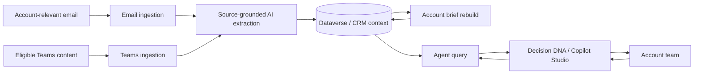

# Decision DNA
### Customer conversations → connected context → grounded decisions

**An interactive architecture and project-value showcase for Decision DNA.**

Decision DNA brings account-relevant email and Teams conversations into a shared CRM context. It turns fragmented interaction history into source-linked insights, account briefs and evidence-grounded answers for account teams.

> **Presentation only.** This repository contains a static educational website and conceptual documentation. It is not the solution implementation, a deployable Power Platform package, or a live tenant-connected assistant. All on-page examples are fictional and illustrative.

## Explore

Visit **[the interactive showcase](https://agentgeorgesamuel.github.io/account-context-hub/)** to inspect the architecture, walk through the four flows, explore illustrative query modes, and review scope and business value. The site can also be opened locally with no build step or dependencies.

- [Architecture and information lifecycle](docs/ARCHITECTURE.md)
- [Four conceptual flow definitions](docs/FLOWS.md)
- [Business value and success measures](docs/VALUE.md)
- [Scope, validation boundaries and roadmap](docs/SCOPE.md)
- [Publication and privacy boundary](PRIVACY.md)

## Why this project matters

Customer decisions are rarely captured in one place. The technical discussion may be in email, objections in a meeting, next steps in a chat, and opportunity state in CRM. Decision DNA connects those fragments without treating AI interpretation as business fact.

| Need | Project contribution |
|---|---|
| Prepare for an account discussion | Bring interaction summaries, actions and current deal state into one view |
| Transfer an account to a new owner | Preserve dated decision evidence and source links instead of relying on memory |
| Understand why a deal progressed | Connect recorded rationale to the opportunity; distinguish open, won and lost |
| Reuse a successful approach | Find recorded winning plays without inventing a causal explanation |
| Prioritize follow-up | Surface recorded risks and open actions across accounts |
| Trust the summary | Retain source-bearing notes, disclose evidence boundaries and handle ambiguity |

These are intended benefits, **not measured ROI claims**.

## Architecture at a glance

**Platform roles:** Power Automate orchestrates; AI Builder prompts extract and summarize; Dataverse holds relational context and notes; Dynamics CRM exposes account history; Copilot Studio presents grounded answers.

## Four flows

| Flow | Purpose | Invocation |
|---|---|---|
| ACX – Ingest Email | Resolve account/contact, extract evidence, create an insight and note without replay duplicates | Scheduled polling |
| ACX – Ingest Teams Meetings | Process eligible messages/available meeting content with privacy gates | Scheduled polling |
| ACX – Rebuild Account Brief | Aggregate interactions into a bounded, source-aware account brief | Scheduled or manual |
| ACX – Agent Query | Retrieve account, winning-play or portfolio context for Decision DNA | On-demand agent tool |

Flow descriptions are deliberately **conceptual**: no exported definitions, connector bindings, expressions, prompt source, credentials or deployment instructions are included.

## Evidence and limits

Prior project checks recorded successful email and posted-Teams-summary ingestion, replay deduplication, account-brief generation, the three query modes and agent publication. This showcase does not re-run those checks or expose private validation records.

A newly recorded Teams meeting's native transcript path remains unverified. Long-source chunking, extended-outage backfill and production-scale validation are not represented as complete. See [scope](docs/SCOPE.md).

## Run locally

Open `index.html` directly, or serve this directory with a static web server. No Microsoft login, secrets, tenant connection, analytics or external JavaScript is required. GitHub Pages can publish the repository root from the main branch.

## Publication boundary

Presentation HTML/CSS/JavaScript is public by design. The actual solution code, flow exports, agent configuration, prompts, tenant identifiers, customer records, original screenshots and private verification evidence are excluded. Do not add them to issues, pull requests or commit history.

Microsoft product names identify architectural components; this independent showcase does not imply Microsoft endorsement.
